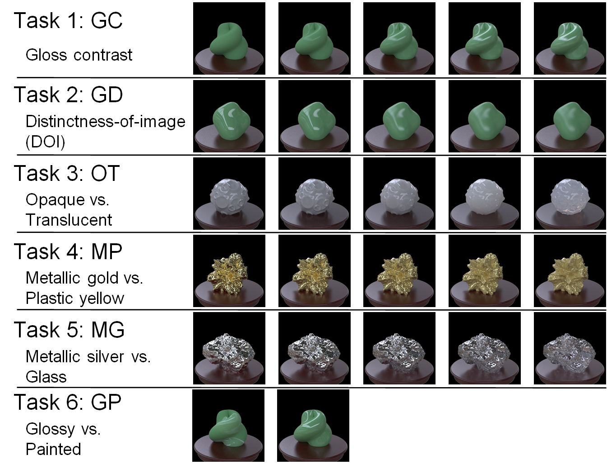
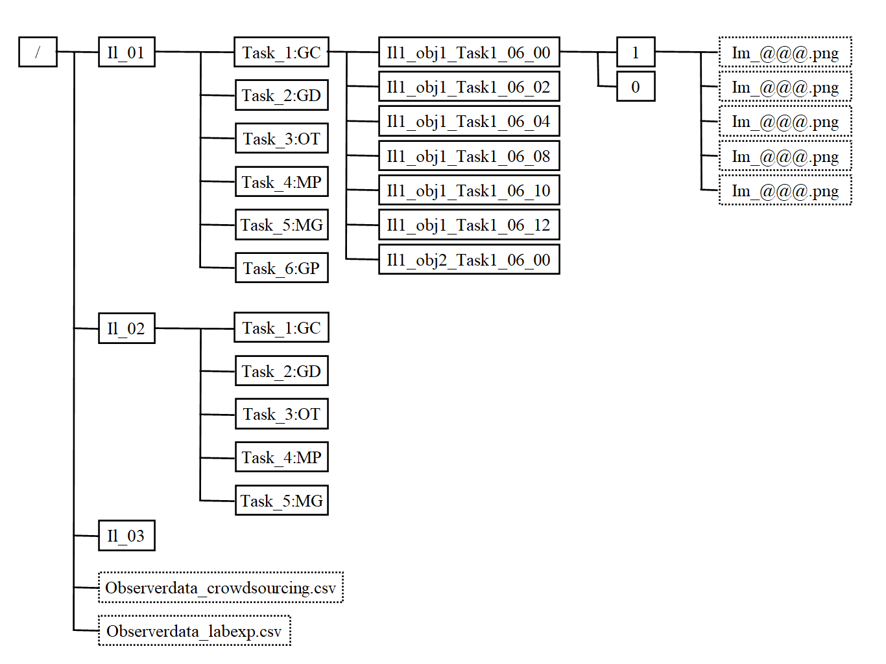

# Visual discrimination of optical material properties: a large-scale study


This repository shares the image dataset and source codes used in the research paper, 
"Visual discrimination of optical material properties: a large-scale study."

Link to paper: https://jov.arvojournals.org/article.aspx?articleid=2778599

## Abstract

Complex visual processing involved in perceiving the object materials can be better elucidated 
by taking a variety of research approaches. Sharing stimulus and response data is an effective strategy 
to make the results of different studies directly comparable and can assist researchers with different backgrounds 
to jump into the field. Here, we constructed a database containing several sets of material images annotated with 
visual discrimination performance. We created the material images using physically-based computer graphics techniques
and conducted psychophysical experiments with them in both laboratory and crowdsourcing settings. The observer’s task
was to discriminate materials on one of six dimensions (gloss contrast, gloss distinctness-of-image, translucent vs. 
opaque, metal vs. plastic, metal vs. glass, and glossy vs. painted). The illumination consistency and object geometry 
were also varied. We used a non-verbal procedure (an oddity task) applicable for diverse use-cases such as 
cross-cultural, cross-species, clinical, or developmental studies. Results showed that the material discrimination 
depended on the illuminations and geometries and that the ability to discriminate the spatial consistency of specular
highlights in glossiness perception showed larger individual differences than in other tasks. In addition, analysis
of visual features showed that the parameters of higher-order color texture statistics can partially, 
but not completely, explain task performance. The results obtained through crowdsourcing were highly correlated with 
those obtained in the laboratory, suggesting that our database can be used even when the experimental conditions are 
not strictly controlled in the laboratory. 



## Download image dataset

Users can download the image dataset from the following link. 

https://www.dropbox.com/s/btdiojzqku0hac9/material_swym.zip?dl=0

Our dataset is divided into three folders according to the illumination conditions. 
Each illumination condition folder contains folders of the material tasks (Task 1 to 6). 
Each material task folder includes experimental task folders. 
Each experimental task folder corresponds to one task in the behavioural experiments. 
The name of each folder indicates the illumination condition, object, material task, and task level. 
For instance, the name “Il1_obj1_Task1_06_12” indicates illumination condition 1 (i.e., Il1), object 1 (i.e., obj1), task 1 (Task1), 
contrast of 0.06 for the non-target stimulus, and contrast of 0.12 for the comparison stimulus.

Each task folder contains the two folders named “1” and “0”. The images in the folder “0” indicate the non-target 
stimuli, while the images in the folder “1” are the target stimuli. Under illumination condition 1, 
three images are randomly selected from folder “0”, and one correct image is selected from folder “1”. 
Five images with different poses are stored in each “1” or “0” folder for illumination condition 1, 
while three images with different illuminations are stored for illumination conditions 2 and 3. 
The images in the database are in .png format and have a size of 512 x 512 px. 
In addition, standard observer data are placed on the top layer in the database in a .csv file. 
The file includes observer data including the probability of the correct response and the sensitivity d’ 
for each task in the crowdsourcing and laboratory experiments.



## Playground for the material task

(Under preparation) We are preparing a playground for users to easily test our material task in their web browsers with javascript, combined with the author's another open-source test battery project (https://github.com/mswym/cog_testbattery) (Adolphe, Sawayama, Maurel, Delmas, Oudeyer, & Sauzeon, in preparation). 

## Render more images

(Under preparation)  Depending on their purpose, users may need to expand our dataset. We rendered the images using Mitsuba 1 (version 0.5.0) (Jakob, 2010) (https://www.mitsuba-renderer.org/). The source scripts are stored in the `render` directory. The illumination environment maps can be downloadable from Bernhard Vogl’s light probe database (http://dativ.at/lightprobes/). We used ShapeToolbox: https://github.com/saarela/ShapeToolbox  (Saarela & Olkkonen, 2016, Saarela, 2018) for the geometry creation. 


## Citation

```
@article{sawayama2022visual,
  title={Visual discrimination of optical material properties: a large-scale study},
  author={Sawayama, Masataka and Dobashi, Yoshinori and Okabe, Makoto and Hosokawa, Kenchi and Koumura, Takuya and Saarela, Toni and Olkkonen, Maria and Nishida, Shin’ya},
  journal={Journal of Vision},
  volume={22},
  number={?},
  pages={?--?},
  year={2022},
  publisher={The Association for Research in Vision and Ophthalmology}
}
```
